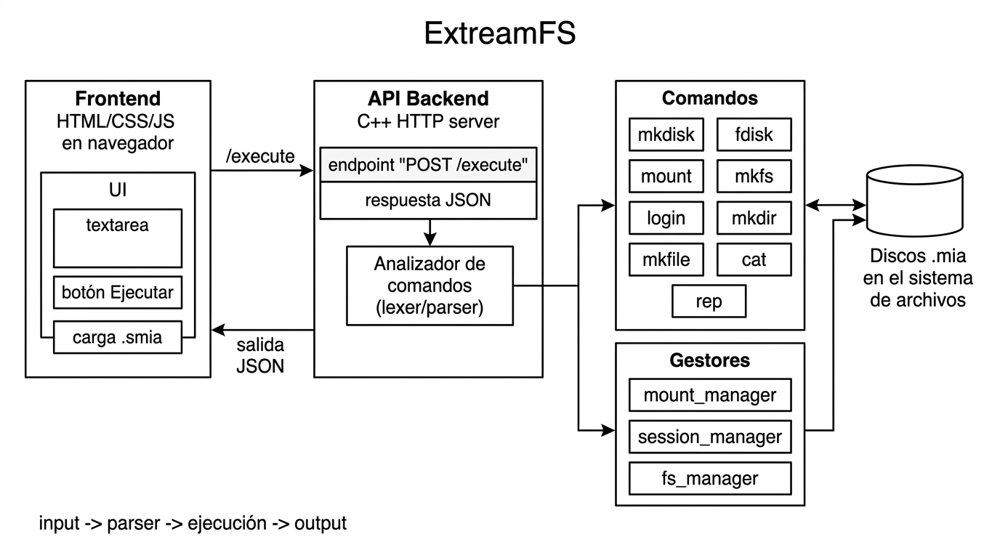
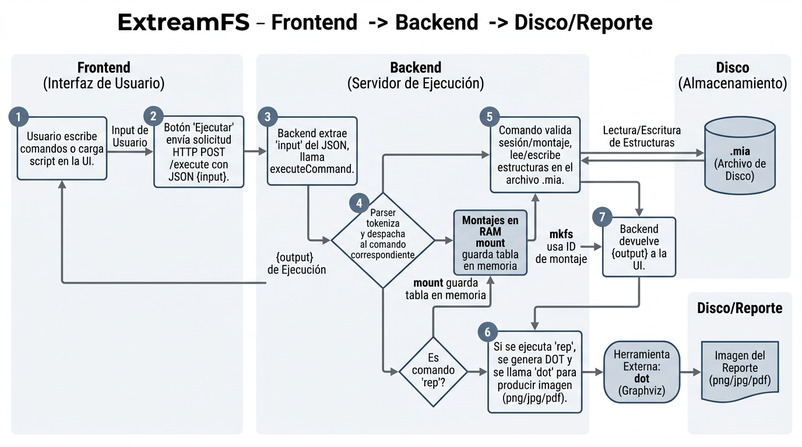
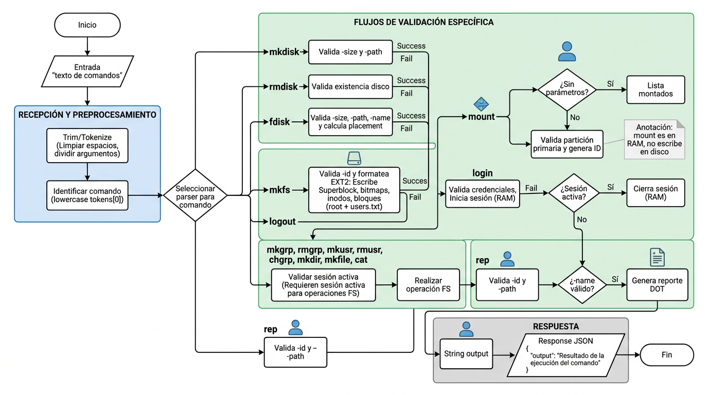
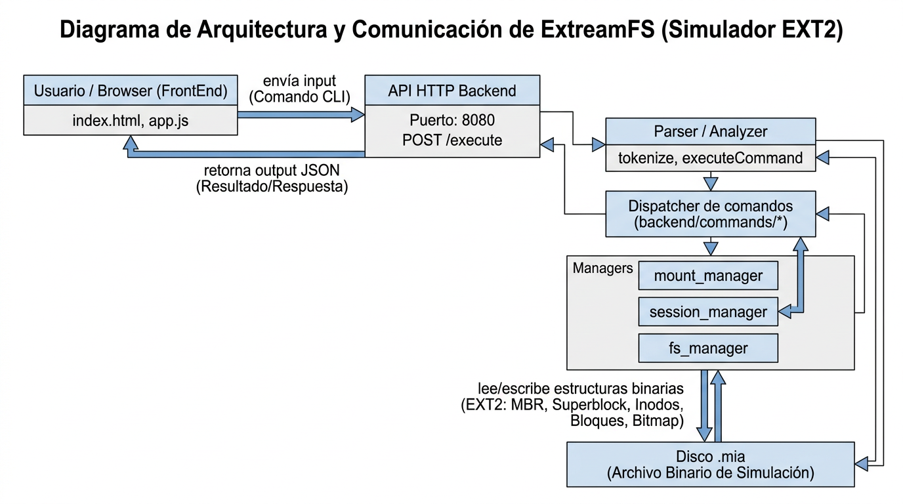
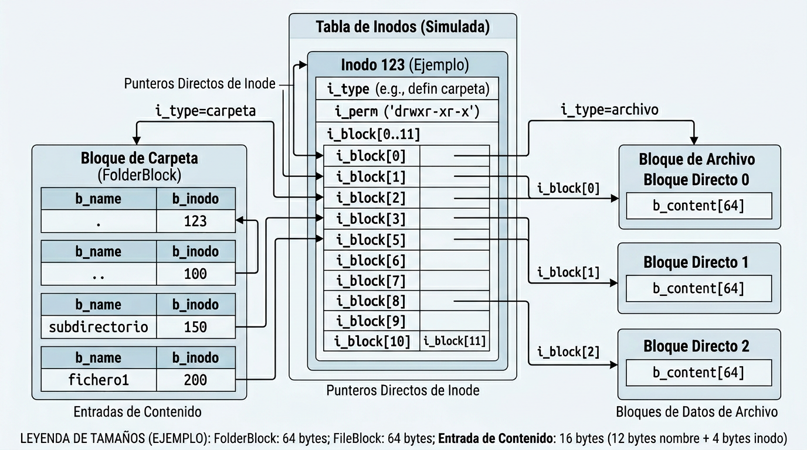
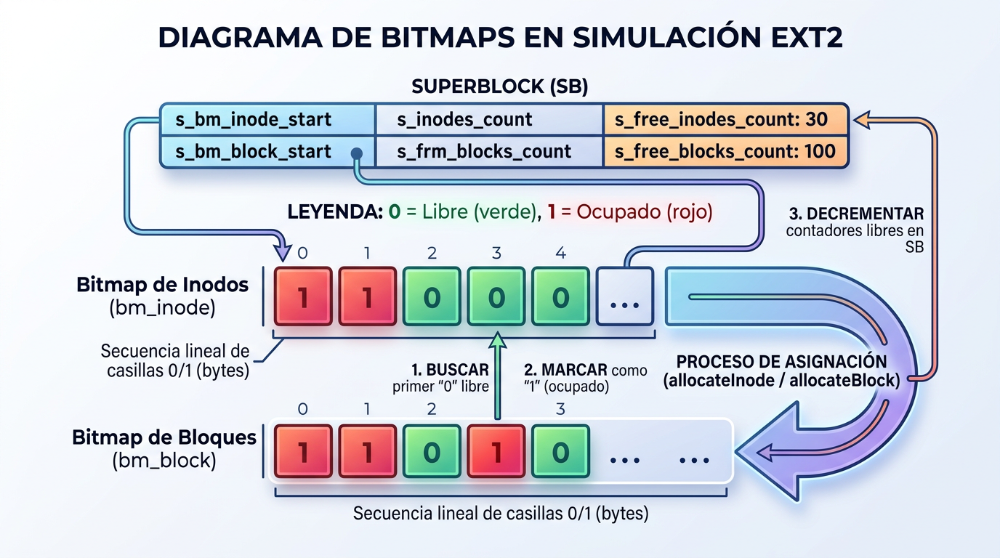
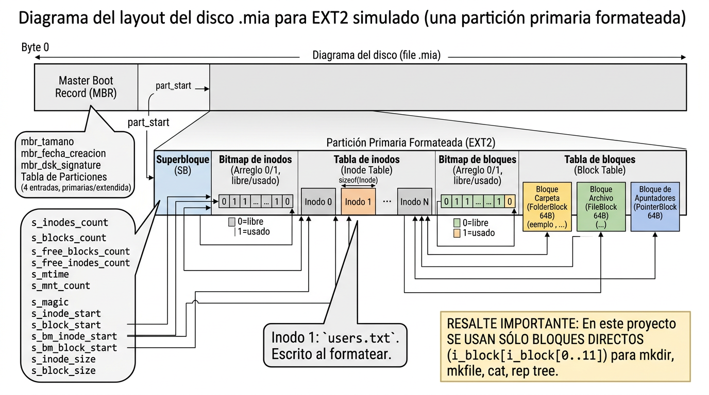

# Manual Técnico (ExtreamFS - EXT2 simulado)

Este manual describe el funcionamiento interno y el uso técnico del sistema de simulación de archivos EXT2 implementado en el repositorio `Proyecto1_MIA`.

## 1. Información General del Proyecto

### Nombre del proyecto
ExtreamFS

### Descripción general
ExtreamFS es una aplicación web local que permite:
- Crear discos virtuales con extensión `.mia`.
- Administrar particiones dentro del disco.
- Montar particiones en memoria (RAM).
- Formatear una partición montada como EXT2.
- Gestionar usuarios, grupos, archivos y carpetas simulados.
- Generar reportes visuales mediante Graphviz (`dot`).

### Objetivo del sistema
Simular, mediante un backend en C++, las estructuras y operaciones internas de un sistema de archivos basado en EXT2, utilizando un archivo binario `.mia` como “disco” y una interfaz web para ejecutar comandos.

### Tecnologías utilizadas
- Backend: C++ (servidor HTTP + analizador de comandos).
- Frontend: HTML/CSS/JS (zona de entrada/salida y carga opcional de scripts).
- Graphviz: generación de reportes a partir de DOT (llamada a `dot` vía `std::system`).
- Comunicación: HTTP API REST simple.

### Lenguajes utilizados
- C++ (backend).
- JavaScript/HTML/CSS (frontend).
- DOT/Graphviz (reportes).

### Estructura general del sistema (alto nivel)
- El `frontend/` envía el texto de comandos al backend.
- El `backend/` expone el endpoint `POST /execute`.
- El backend tokeniza el comando y despacha a la implementación correspondiente en `backend/commands/**`.
- Las operaciones EXT2 se realizan leyendo/escribiendo estructuras en el archivo binario `.mia`.
- El comando `rep` genera un reporte DOT y produce una imagen/exportación ejecutando `dot`.

## 2. Arquitectura del Sistema

### Cómo funciona el frontend
El frontend se implementa en `frontend/`:
- `frontend/index.html`: interfaz con:
  - Textarea de entrada (`#inputCommands`)
  - Textarea de salida (`#outputCommands`)
  - Botón `Ejecutar`
  - Selector de archivo `.smia` (carga el contenido al textarea)
- `frontend/app.js`: al presionar `Ejecutar`:
  - Toma `inputEl.value`
  - Realiza `fetch('http://localhost:8080/execute')`
  - Envía JSON con la clave `input`
  - Muestra el valor `output` devuelto por el backend

### Cómo funciona el backend
El backend inicia el servidor HTTP desde `backend/main.cpp`, y el endpoint principal se implementa en `backend/server/http_server.cpp`.

En `POST /execute`:
1. Se extrae el string `input` del JSON recibido (en `parseInputFromJson`).
2. Se llama a `extreamfs::analyzer::executeCommand(input)`.
3. Se devuelve una respuesta JSON con `{ "output": "<texto>" }`.

### Comunicación Frontend → Backend (API)
- Endpoint: `POST /execute`
- Cuerpo JSON esperado:
  - `{"input":"comando aquí"}`
- Respuesta JSON:
  - `{"output":"respuesta del backend"}`

### Flujo de ejecución de comandos (backend)
El analizador se implementa en `backend/analyzer/parser.cpp`:
- Normaliza el comando con `toLower(tokens[0])`.
- Tokeniza separando por espacios/tabs y respetando parámetros entre comillas dobles.
- Despacha según el nombre del comando:
  - `mkdisk`, `rmdisk`, `fdisk`
  - `debugmbr`, `debugebr`
  - `mount`, `mkfs`
  - `login`, `logout`
  - `mkgrp`, `rmgrp`, `mkusr`, `rmusr`, `chgrp`
  - `mkdir`, `mkfile`
  - `cat`, `rep`

### Procesamiento de scripts (.smia)
El frontend permite cargar un archivo `.smia` y copiar su contenido en la textarea.
Sin embargo, el backend ejecuta únicamente el contenido recibido como un comando único: el parser solo separa tokens por espacios y tabuladores.
Los saltos de línea del `.smia` no se tratan como separadores, por lo que un script con múltiples líneas normalmente se interpretará como un solo comando y puede fallar.

> Nota: El proyecto soporta la carga del contenido al textarea, pero el procesamiento multi-comando del script depende de que el input final enviado al backend sea compatible con el parser actual.

### Diagramas (generados)

#### Diagrama de arquitectura


#### Flujo del sistema


#### Flujo de ejecución de comandos


#### Diagrama de arquitectura y comunicación


#### Estructura del archivo `.mia`


#### Relación Inodos → Bloques


#### Bitmaps y asignación


## 3. Estructuras de Datos Implementadas

Las estructuras siguientes están implementadas en los headers:
- `backend/disk/mbr.h`
- `backend/disk/partition.h`
- `backend/disk/ebr.h`
- `backend/filesystem/superblock.h`
- `backend/filesystem/inode.h`
- `backend/filesystem/blocks.h`

Todas las estructuras relevantes están con `#pragma pack(push, 1)` para evitar padding.

### 3.1 MBR

#### Descripción
Estructura almacenada al inicio del archivo disco `.mia`. Contiene información del disco y un arreglo de 4 particiones.

#### Campos
En `backend/disk/mbr.h`:
- `int mbr_tamano`: tamaño total del disco (bytes)
- `time_t mbr_fecha_creacion`: fecha/hora de creación
- `int mbr_dsk_signature`: firma random del disco
- `char dsk_fit`: ajuste global del disco (`B`, `F`, `W`)
- `Partition mbr_partitions[4]`: tabla de 4 particiones

#### Cómo se usa en el sistema
- `backend/commands/disk/mkdisk.cpp` escribe el MBR en byte 0.
- `backend/commands/disk/fdisk.cpp` lee el MBR y actualiza la entrada de partición primaria/extendida.
- `backend/commands/reports/rep.cpp` lo reporta con `-name=mbr`.

#### Ejemplo visual
Ver el layout del archivo `.mia` (MBR + particiones) en `../imagenes/diagramas/06-layout-disco-mia.png`.

### 3.2 Particiones (primarias y extendida)

#### Descripción
Estructura `Partition` dentro del MBR.

#### Campos
En `backend/disk/partition.h`:
- `char part_status`: `'1'` si está activa, `'0'` si no
- `char part_type`: `'P'` primaria, `'E'` extendida
- `char part_fit`: ajuste de partición (`B`, `F`, `W`)
- `int part_start`: byte inicial dentro del disco
- `int part_s`: tamaño en bytes
- `char part_name[16]`: nombre (se limita en la implementación a 15 chars + `\0`)
- `int part_correlative`: correlativo (en la creación queda en `-1`)
- `char part_id[4]`: ID (en creación se inicializa a `0`)

#### Cómo se usa en el sistema
- `mkdisk` inicializa estas estructuras como “vacías”.
- `fdisk` crea particiones y rellena los campos.
- `mount` busca particiones por `part_name` y **solo permite montar primarias** (en la implementación actual).
- `mkfs` busca la partición primaria montada por nombre.

#### Ejemplo visual
El diagrama del layout del archivo `.mia` muestra las particiones (primaria/extendida) dentro del MBR en `../imagenes/diagramas/06-layout-disco-mia.png`.

### 3.3 EBR (Extended Boot Record)

#### Descripción
Estructura para manejar particiones lógicas dentro de la partición extendida.
Se usa como una cadena enlazada mediante `part_next`.

#### Campos
En `backend/disk/ebr.h`:
- `char part_mount`: estado (en creación se usa `'0'`)
- `char part_fit`: ajuste (B/F/W)
- `int part_start`: byte inicial del “data” de la partición lógica
- `int part_s`: tamaño en bytes de la lógica
- `int part_next`: byte del siguiente EBR (`-1` si no existe)
- `char part_name[16]`: nombre de la lógica

#### Cómo se usa en el sistema
- `backend/commands/disk/fdisk.cpp` crea y encadena EBRs al crear particiones lógicas.
- `rep -name=mbr` incluye la cadena de EBRs dentro de la tabla HTML del MBR cuando la partición extendida existe.
- `mount` en este proyecto no monta lógicas; por eso `mkfs` solo trabaja con primarias.

#### Ejemplo visual
La cadena de EBRs se representa en el layout del archivo `.mia` (partición extendida) en `../imagenes/diagramas/06-layout-disco-mia.png`.

### 3.4 Superbloque (SB)

#### Descripción
Contiene metadatos del sistema de archivos EXT2 y direcciones (offsets) dentro de la partición.
Se escribe **una vez** por partición formateada por `mkfs`.

#### Campos
En `backend/filesystem/superblock.h`:
- `int s_filesystem_type`: identifica EXT2 (en implementación se usa `2`)
- `int s_inodes_count`: número total de inodos
- `int s_blocks_count`: número total de bloques
- `int s_free_blocks_count`: cantidad de bloques libres
- `int s_free_inodes_count`: cantidad de inodos libres
- `int s_mtime`, `int s_umtime`: tiempos (implementados como `int`)
- `int s_mnt_count`: contador de montajes (arranca en `0`)
- `int s_magic`: `0xEF53` para validar EXT2
- `int s_inode_s`: tamaño de inodo (88)
- `int s_block_s`: tamaño de bloque (64)
- `int s_firts_ino`: primer inodo libre
- `int s_first_blo`: primer bloque libre
- `int s_bm_inode_start`: inicio del bitmap de inodos
- `int s_bm_block_start`: inicio del bitmap de bloques
- `int s_inode_start`: inicio de la tabla de inodos
- `int s_block_start`: inicio de la tabla/región de bloques

#### Cómo se usa en el sistema
- `backend/commands/fs/mkfs.cpp` calcula `n_inodes` y `n_blocks` a partir del tamaño de la partición y escribe el SB.
- `backend/manager/fs_manager.cpp` usa offsets del SB para leer/escribir:
  - inodos
  - bloques carpeta/archivo
  - bitmaps de inodos/bloques
- `rep` genera reportes de SB.

#### Ejemplo visual
El SB y sus offsets (bitmaps, tabla de inodos y región de bloques) se muestran en el diagrama del EXT2 simulado en `../imagenes/diagramas/04-ext2-layout.png` y en `../imagenes/diagramas/06-layout-disco-mia.png`.

### 3.5 Inodos

#### Descripción
Estructura `Inode` representa un archivo o carpeta.

#### Campos
En `backend/filesystem/inode.h`:
- `int i_uid`: UID del propietario
- `int i_gid`: GID del propietario de grupo
- `int i_s`: tamaño (bytes)
- `int i_atime`, `int i_ctime`, `int i_mtime`: tiempos (int)
- `int i_block[15]`: apuntadores directos/indirectos
  - En este proyecto, para operaciones `mkdir/mkfile/cat/rep tree`, se usan los índices directos (y se inicializa el resto en `-1`)
- `char i_type`: `1` archivo, `0 carpeta`
- `char i_perm[3]`: permisos UGO en forma octal (almacenados como caracteres `'0'..'7'`)

#### Cómo se usa en el sistema
- `mkfs` crea el inode raíz (`inode 0`) y el inode de `users.txt` (`inode 1`).
- `mkdir`/`mkfile` asignan inodos nuevos y actualizan el directorio padre (bloques carpeta).
- `cat` valida permisos usando `i_perm` y lee el contenido apuntado por `i_block` (directos).
- `rep` reporta inodos y árboles.

#### Ejemplo visual
La relación `inode.i_block` → bloques de carpeta/archivo se resume en `../imagenes/diagramas/07-relacion-inodos-bloques.png`.

### 3.6 Bloques

#### Descripción
Los bloques se almacenan en regiones contiguas dentro de la partición.
Tamaños:
- Bloque carpeta: 64 bytes
- Bloque archivo: 64 bytes
- Bloque apuntadores: existe en la estructura, pero este proyecto no lo usa en operaciones EXT2 actuales.

En `backend/filesystem/blocks.h`:
- `FolderBlock`:
  - `Content b_content[4]` (4 entradas, 64 bytes total)
- `FileBlock`:
  - `char b_content[64]`
- `PointerBlock`:
  - `int b_pointers[16]`

#### Cómo se usan en el sistema
- `mkfs` escribe:
  - `FolderBlock` para `/` (inode raíz)
  - `FileBlock` para `users.txt`
- `mkdir` crea nuevos `FolderBlock` y actualiza el bloque del directorio padre.
- `mkfile` crea `FileBlock` y actualiza el directorio padre.
- `cat` concatena el contenido desde `FileBlock`.
- `rep` crea reportes `block`, `tree`, etc.

#### Ejemplo visual
Tipos de bloques (carpeta/archivo) y cómo se enlazan desde `i_block` se ilustran en `../imagenes/diagramas/07-relacion-inodos-bloques.png`.

### 3.7 Bitmap de Inodos (bm_inode)

#### Descripción
El proyecto maneja el bitmap de inodos como una secuencia/array de bytes en el disco, donde:
- `0` = inodo libre
- `1` = inodo ocupado

#### Campos (representación)
Este bitmap no tiene “campos” internos como struct; es un arreglo binario de tamaño:
- `s_inodes_count` bytes (se lee/escribe como `vector<char>`).

#### Cómo se usa en el sistema
- `mkfs` inicializa el bitmap marcando ocupados los primeros índices:
  - `bm_inode[0]=1` (inode raíz)
  - `bm_inode[1]=1` (`users.txt`)
- `backend/manager/fs_manager.cpp::allocateInode`:
  1. lee el bitmap en `s_bm_inode_start`
  2. busca el primer `0`
  3. marca ese índice como `1`
  4. decrementa `sb.s_free_inodes_count`
- `rep -name=bm_inode` lee el bitmap desde `s_bm_inode_start` y lo exporta con Graphviz.

#### Ejemplo visual / diagrama
Ver `../imagenes/diagramas/08-bitmaps-offsets.png` (sección `bm_inode`, 0=libre / 1=ocupado).

### 3.8 Bitmap de Bloques (bm_block)

#### Descripción
El proyecto maneja el bitmap de bloques como una secuencia/array de bytes en el disco, donde:
- `0` = bloque libre
- `1` = bloque ocupado

#### Campos (representación)
Este bitmap no tiene “campos” internos como struct; es un arreglo binario de tamaño:
- `s_blocks_count` bytes.

#### Cómo se usa en el sistema
- `mkfs` inicializa el bitmap marcando ocupados los primeros índices:
  - `bm_block[0]=1` (carpeta raíz)
  - `bm_block[1]=1` (`users.txt`)
- `backend/manager/fs_manager.cpp::allocateBlock`:
  1. lee el bitmap en `s_bm_block_start`
  2. busca el primer `0`
  3. marca ese índice como `1`
  4. decrementa `sb.s_free_blocks_count`
- `rep -name=bm_block` lee el bitmap desde `s_bm_block_start` y lo exporta con Graphviz.

#### Ejemplo visual / diagrama
Ver `../imagenes/diagramas/08-bitmaps-offsets.png` (sección `bm_block`, 0=libre / 1=ocupado).

## 4. Sistema de Archivos EXT2 Simulado

### Cómo se simula el disco
El comando `mkdisk` crea el archivo `.mia` binario:
- Rellena el archivo hasta el tamaño indicado con `0x00`.
- Escribe un `MBR` al inicio del archivo.

Implementación:
- `backend/commands/disk/mkdisk.cpp`

### Cómo se almacenan los datos
Dentro de una partición primaria formateada por `mkfs` se guarda:
1. `Superblock` (SB) al inicio de la partición (offset `part_start`)
2. Bitmap de inodos (bytes 0/1)
3. Tabla de inodos (arreglo de `Inode`, tamaño `s_inode_s=88`)
4. Bitmap de bloques (bytes 0/1)
5. Región de bloques (`FolderBlock`/`FileBlock`)

> Importante: este proyecto usa principalmente bloques directos representados por `i_block[0..11]` en operaciones (por ejemplo `mkdir`, `mkfile`, `cat` y `rep tree`).

### Cómo se gestionan las particiones
- `fdisk` escribe estructuras `Partition` en el MBR.
- Si se crea una partición extendida con lógicas, `fdisk` crea una cadena EBR.
- En este proyecto:
  - `mount` permite montar **solo particiones primarias**.
  - `mkfs` formatea **solo particiones primarias montadas**.

### Cómo se crean archivos y carpetas

#### Carpetas (`mkdir`)
- Requiere sesión activa.
- Determina el directorio padre recorriendo la estructura mediante bloques carpeta.
- Si el directorio existe, agrega una entrada en el bloque carpeta padre.
- Si se requiere un bloque adicional para el directorio padre:
  - asigna un bloque con `allocateBlock`
  - actualiza el arreglo `i_block` del inodo del directorio
- Crea un nuevo `Inode` con:
  - `i_type = 0` (carpeta)
  - `i_perm = 664` (guardado como caracteres `'6','6','4'`)
  - `i_block[0]=blockIndex` y el resto en `-1`

#### Archivos (`mkfile`)
- Requiere sesión activa.
- Determina el directorio padre (recorriendo inodos y `FolderBlock`).
- Crea un nuevo `Inode` con:
  - `i_type = 1` (archivo)
  - `i_perm = 664`
  - `i_s = sizeFinal`
- Reserva bloques `FileBlock` (máximo 12 bloques directos en esta implementación).
- Escribe el contenido:
  - Si se usa `-cont`, copia el archivo externo.
  - Si se especifica `-size`, ajusta/palindrome el tamaño para llegar a `size`:
    - Si el contenido externo es menor, completa con `0123456789` repetido.

### Manejo de usuarios y permisos

#### users.txt
- `mkfs` crea automáticamente un archivo lógico `users.txt`:
  - Inode index: `1`
  - Contenido inicial:
    - `1,G,root\n`
    - `1,U,root,root,123\n`
- Este archivo se guarda en bloques tipo `FileBlock`.

#### Sesión y permisos
- `login` valida credenciales leyendo `users.txt` y guarda sesión en RAM (no persiste sesión al disco).
- `cat` valida permisos de lectura:
  - Si el usuario logueado es `root`, siempre puede leer.
  - Si no, obtiene el nivel de permisos a partir de `i_perm` y compara:
    - `i_uid` vs UID de sesión (User)
    - `i_gid` vs GID de sesión (Group)
    - si no coincide, usa permisos Other
  - Lee si el bit de lectura está activo: `(perm & 4) != 0`

> Nota de precisión sobre `root` y permisos:
> - En este proyecto, `root` “bypassea” la lectura en `cat` (verificación implementada en `canRead()`).
> - Para crear/modificar (`mkdir`, `mkfile`, etc.), el proyecto valida principalmente que exista sesión activa; en estas operaciones no se verifica explícitamente el permiso de escritura usando `i_perm` (por lo tanto, la regla de “root con 777” del enunciado no se modela como motor completo de permisos de escritura).

### Diagramas (EXT2)



## 5. Comandos Implementados

En el backend, el parser reconoce los comandos (case-insensitive) y sus parámetros con la lógica definida en `backend/analyzer/parser.cpp`.

Para todos los comandos:
- Los parámetros deben separarse con espacios.
- Valores con espacios deben ir entre comillas dobles `"..."`.
- El parser hace `toLower(tokens[0])` para el nombre del comando.

### 5.1 `MKDISK` (`mkdisk`)

#### Descripción
Crea un archivo binario que simula un disco `.mia` y escribe el `MBR` inicial.

#### Parámetros
- Obligatorios
  - `-size=` (entero > 0): tamaño del disco
  - `-path=` (string): ruta del archivo `.mia`
- Opcionales
  - `-unit=`: `K`/`k` (KB) o `M`/`m` (MB). Default: `M`.
  - `-fit=`: `BF`/`FF`/`WF` (Best/First/Worst). Default: `FF`.

#### Ejemplo de uso
```bash
mkdisk -size=10 -unit=M -path="/home/user/Disco1.mia"
```

#### Funcionamiento interno (estructuras modificadas)
- Archivo `.mia`: se rellena con `0x00` hasta el tamaño indicado.
- `MBR`:
  - `mbr_tamano`, `mbr_fecha_creacion`, `mbr_dsk_signature`, `dsk_fit`
  - limpia las 4 `Partition` con valores de no-uso (`part_start=-1`, `part_type='0'`, etc.)

### 5.2 `RMDISK` (`rmdisk`)

#### Descripción
Elimina el archivo `.mia` si existe y no tiene particiones montadas en RAM.

#### Parámetros
- Obligatorio
  - `-path=` ruta del disco `.mia`

#### Ejemplo
```bash
rmdisk -path="/home/user/Disco1.mia"
```

#### Funcionamiento interno
- Verifica existencia y consulta `backend/manager/mount_manager` para impedir eliminación si hay montajes.
- Elimina el archivo con `std::filesystem::remove`.

### 5.3 `FDISK` (`fdisk`)

#### Descripción
Administra particiones dentro del `.mia`:
- Primarias
- Extendida
- Lógicas (EBR)

#### Parámetros
- Obligatorios
  - `-size=` (entero > 0)
  - `-path=` ruta del disco
  - `-name=` nombre de la partición
- Opcionales
  - `-unit=`: `B`/`b`, `K`/`k`, `M`/`m`. Default: `K`
  - `-type=`: `P` primaria, `E` extendida, `L` lógica. Default: `P`
  - `-fit=`: `BF`/`FF`/`WF`. Default: `FF`

#### Ejemplos
```bash
fdisk -size=300 -path=/home/Disco1.mia -name=Particion1
fdisk -type=E -size=300 -unit=K -fit=WF -path=/home/Disco2.mia -name=Particion2
fdisk -size=1 -unit=M -type=L -fit=BF -path="/mis discos/Disco3.mia" -name="Particion3"
```

#### Funcionamiento interno (estructuras modificadas)
- Lee el `MBR` (`backend/commands/disk/fdisk.cpp`).
- Calcula regiones libres y elige una región para la partición (por el `mbr.dsk_fit` definido al crear el disco).
- Primaria/Extendida:
  - actualiza un slot vacío en `mbr_partitions[]`
  - escribe el `MBR` al inicio del disco
- Lógica:
  - ubica la partición extendida en el MBR
  - recorre o crea la cadena de `EBR` (`part_next`)
  - inserta nuevos EBRs al final de la cadena

### 5.4 `MOUNT` (`mount`)

#### Descripción
Monta una partición **primaria** en memoria RAM y genera un ID en base a un contador de montajes (tabla en RAM).

No existe el comando `mounted`/`MOUNTED` como tal en este proyecto.
Para listar particiones montadas en RAM, ejecute `mount` sin parámetros.

#### Generación de ID
La generación de ID se basa en `backend/manager/mount_manager.cpp`:
- `CARNET` está hardcodeado como `202300689`, por lo que `lastTwo = 89`.
- `partitionNumber` es el consecutivo (1-based) de particiones montadas para la misma ruta `-path`.
- `letter` depende del orden de montajes de discos distintos (primera ruta distinta => `A`, segunda => `B`, etc.).
- El ID se construye como: `<lastTwo><partitionNumber><letter>` (ejemplo conceptual: `891A`, `891B`, etc.).

#### Parámetros
Dos modos:
- Modo listar
  - `mount` (sin parámetros)
- Modo montar
  - `-path=` ruta del disco `.mia` (obligatorio)
  - `-name=` nombre de la partición primaria (obligatorio)

#### Ejemplo
```bash
mount -path=/home/Disco2.mia -name=Particion2
mount
```

#### Funcionamiento interno (estructuras modificadas)
- No modifica en disco el estado `part_status/part_correlative/part_id`.
- Mantiene `mountedPartitions` en memoria a través de `backend/manager/mount_manager`.
- Valida:
  - que la partición exista por nombre dentro del MBR/EBR (pero luego exige que sea primaria)
  - que no esté montada duplicada (por `(path,name)`)

### 5.5 `MKFS` (`mkfs`)

#### Descripción
Formatea una partición montada como EXT2 y crea `users.txt` en el sistema de archivos.

#### Parámetros
- Obligatorio
  - `-id=` ID de la partición generada por `mount`
- Opcional
  - El enunciado contempla `-type=full`, pero el parser actual no consume `-type`.
    La implementación formatea siempre como EXT2 (equivalente a "full" en este proyecto).

#### Ejemplo
```bash
mkfs -id=341A
```

#### Funcionamiento interno (estructuras modificadas)
Se realiza en `backend/commands/fs/mkfs.cpp`:
- Valida ID montado en RAM.
- Encuentra la partición primaria correspondiente en el MBR.
- Calcula:
  - `n_inodes` y `n_blocks` con la fórmula implementada
  - offsets dentro de la partición:
    - `s_bm_inode_start`, `s_bm_block_start`, `s_inode_start`, `s_block_start`
- Escribe:
  - `Superblock`
  - bitmaps iniciales
  - `Inode 0` (carpeta raíz) apuntando a `block 0`
  - `Inode 1` (`users.txt`) apuntando a `block 1`
  - `FolderBlock` de raíz: entradas `.` `..` `users.txt`
  - `FileBlock` de `users.txt`

### 5.6 `LOGIN` (`login`)

#### Descripción
Inicia sesión en el sistema de archivos simulado.

#### Parámetros
- Obligatorios
  - `-user=`
  - `-pass=`
  - `-id=` ID de la partición montada

#### Ejemplo
```bash
login -user=root -pass=123 -id=341A
```

#### Funcionamiento interno
- Requiere no existir sesión activa previa.
- Lee `users.txt` desde el disco (inodo 1) y busca:
  - línea `U` con `uid != 0`, `usuario` y `contraseña` coincidentes
  - línea `G` para obtener `gid` del grupo del usuario
- Guarda sesión en RAM con:
  - `active=true`, `id_particion`, `username`, `uid`, `gid`

### 5.7 `LOGOUT` (`logout`)

#### Descripción
Cierra la sesión activa.

#### Parámetros
Ninguno.

#### Ejemplo
```bash
logout
```

#### Funcionamiento interno
- `backend/manager/session_manager.cpp` reinicia la sesión.

### 5.8 `MKGRP` (`mkgrp`)

#### Descripción
Crea un grupo en `users.txt` (solo `root`).

#### Parámetros
- Obligatorio
  - `-name=`

#### Ejemplo
```bash
mkgrp -name=usuarios
```

#### Funcionamiento interno
- Requiere sesión activa y usuario `root`.
- Lee `users.txt` y valida que no exista otro grupo con ese nombre (`gid != 0`).
- Calcula `newGid = maxGid + 1`.
- Agrega línea: `<newGid>,G,<name>\n`

### 5.9 `RMGRP` (`rmgrp`)

#### Descripción
“Elimina” un grupo marcándolo con estado `0` en `users.txt` (solo `root`).

#### Parámetros
- Obligatorio
  - `-name=`

#### Ejemplo
```bash
rmgrp -name=usuarios
```

#### Funcionamiento interno
- Requiere sesión activa y `root`.
- Reemplaza la línea del grupo con: `0,G,<name>\n`
- No borra la línea; la marca como eliminada.

### 5.10 `MKUSR` (`mkusr`)

#### Descripción
Crea un usuario en `users.txt` (solo `root`).

#### Parámetros
- Obligatorios
  - `-user=`
  - `-pass=`
  - `-grp=`

#### Ejemplo
```bash
mkusr -user=user1 -pass=usuario -grp=usuarios
```

#### Funcionamiento interno
- Valida sesión activa y `root`.
- Valida que el grupo exista (`gid != 0`).
- Valida que el usuario no exista ya.
- Calcula `newUid = maxUid + 1`.
- Agrega línea: `<newUid>,U,<grp>,<user>,<pass>\n`

### 5.11 `RMUSR` (`rmusr`)

#### Descripción
“Elimina” un usuario marcándolo con estado `0` en `users.txt` (solo `root`).

#### Parámetros
- Obligatorio
  - `-user=`

#### Ejemplo
```bash
rmusr -user=user1
```

#### Funcionamiento interno
- Requiere sesión activa y `root`.
- Reemplaza línea `U` del usuario por:
  - `0,U,<gid>,<user>,<pass>\n` (mantiene el grupo original leído desde la línea existente)

### 5.12 `CHGRP` (`chgrp`)

#### Descripción
Cambia el grupo de un usuario (solo `root`).

#### Parámetros
- Obligatorios
  - `-user=`
  - `-grp=`

#### Ejemplo
```bash
chgrp -user=user1 -grp=grupo1
```

#### Funcionamiento interno
- Requiere sesión activa y `root`.
- Valida que el nuevo grupo exista (`gid != 0`).
- Localiza la línea del usuario y actualiza el campo `grp`.

### 5.13 `MKFILE` (`mkfile`)

#### Descripción
Crea un archivo en el sistema EXT2 simulado.

#### Parámetros
- Obligatorio
  - `-path=` ruta absoluta del archivo (incluye nombre)
- Opcionales
  - `-p` (flag): si se incluye y las carpetas padres no existen, se crean.
  - `-size=` entero >= 0: tamaño del archivo en bytes.
  - `-cont=` ruta a un archivo externo del host: contenido a copiar.

#### Ejemplo
```bash
mkfile -size=15 -path=/home/user/docs/a.txt -p
mkfile -size=0 -path="/home/user/docs/a.txt"
mkfile -path="/home/user/docs/b.txt" -p -cont=/tmp/b.txt
```

> En esta implementación, el flag real se detecta como el token `-p` (sin `=`) para crear padres.
> Nota: el enunciado menciona `-r`, pero en el código de este proyecto el flag equivalente es `-p`.

#### Funcionamiento interno (estructuras modificadas)
- Requiere sesión activa.
- Resuelve el inodo del directorio padre recorriendo `FolderBlock`.
- Asigna:
  - nuevo `Inode` (tamaño `i_s`)
  - hasta `12` bloques `FileBlock` (por apuntadores directos)
- Actualiza el directorio padre agregando una entrada en `FolderBlock`.

### 5.14 `MKDIR` (`mkdir`)

#### Descripción
Crea una carpeta en el sistema EXT2 simulado.

#### Parámetros
- Obligatorio
  - `-path=` ruta absoluta de la carpeta
- Opcional
  - `-p` (flag): crea carpetas padres si no existen

#### Ejemplo
```bash
mkdir -p -path=/home/user/docs/usac
mkdir -path="/home/mis documentos/archivos clases"
```

#### Funcionamiento interno
- Requiere sesión activa.
- Resuelve la ruta componente a componente.
- Para cada carpeta inexistente (si `-p` está presente):
  - asigna un nuevo inodo
  - asigna un bloque carpeta (`FolderBlock`)
  - crea entradas `.` y `..`
- Actualiza el directorio padre con una entrada `name -> inode`.

### 5.15 `CAT` (`cat`)

#### Descripción
Muestra el contenido de uno o más archivos.

#### Parámetros
- Mínimo uno (hasta 20)
  - `-file1=...`
  - `-file2=...`
  - ...
  - `-file20=...`

#### Ejemplo
```bash
cat -file1="/home/a.txt" -file2="/home/b.txt"
```

#### Funcionamiento interno (estructuras modificadas)
- Requiere sesión activa.
- Resuelve cada ruta a un inodo:
  - recorre directorios usando bloques carpeta directos
  - localiza el archivo dentro del `FolderBlock`
- Valida permisos de lectura:
  - root siempre lee
  - otros usuarios según `i_perm`
- Lee el contenido desde `FileBlock` usando `i_block[0..14]` pero solo mientras exista `i_block[i] >= 0` y respeta `i_s`.

### 5.16 `REP` (`rep`)

#### Descripción
Genera reportes en Graphviz (`dot`) y produce una imagen/salida en la ruta indicada.

#### Parámetros
- Obligatorios
  - `-name=` tipo de reporte
  - `-path=` ruta destino del reporte (con extensión)
  - `-id=` ID de la partición montada (para ubicar el disco y la partición)
- Opcionales
  - `-ruta=` (requerido por algunos reportes: `file`, `inode`, `block`, `ls`; para `tree` no se usa en la implementación)

#### Reportes soportados por `-name`
Se implementan (según `backend/commands/reports/rep.cpp`):
- `mbr`
- `disk`
- `inode`
- `block`
- `bm_inode`
- `bm_block`
- `tree`
- `sb`
- `file`
- `ls`

#### Ejemplos
```bash
rep -name=mbr  -id=341A -path="/home/user/reports/reporte1.jpg"
rep -name=disk -id=341A -path="/home/user/reports/reporte2.pdf"
rep -name=inode -id=341A -path="/home/user/reports/reporte3.jpg" -ruta="/users.txt"
rep -name=block -id=341A -path="/home/user/reports/reporte4.jpg" -ruta="/users.txt"
rep -name=bm_inode -id=341A -path="/home/user/reports/reporte5.txt"
rep -name=tree -id=341A -path="/home/user/reports/reporte7.jpg"
rep -name=file -id=341A -path="/home/user/reports/reporte9.txt" -ruta="/users.txt"
rep -name=ls -id=341A -path="/home/user/reports/reporte10.jpg" -ruta="/"
```

#### Funcionamiento interno (estructuras modificadas)
- El comando `rep` no modifica el disco; solo lee estructuras y genera DOT.
- En `rep.cpp`:
  - Construye el contenido DOT con tablas HTML.
  - Escribe un archivo `.dot` al lado del output.
  - Ejecuta `dot -T<format> <dotfile> -o <outputPath>`.
  - El formato se decide por la extensión de `-path`:
    - `.jpg`/`.jpeg` => `jpg`
    - `.pdf` => `pdf`
    - de lo contrario => `png`

### 5.17 Comandos adicionales (reconocidos por el parser)
El parser también reconoce:
- `debugmbr -path=...`
- `debugebr -path=...`

Se usan para inspección, no forman parte de la lista obligatoria del enunciado principal.

## 6. Generación de Reportes

El comando `rep` está implementado en `backend/commands/reports/rep.cpp`.

### Uso general de Graphviz
- `rep` crea una cadena DOT (grafo) en memoria.
- Genera un archivo DOT temporal en disco.
- Ejecuta el comando del sistema:
  - `dot -T<format> "<archivo.dot>" -o "<outputPath>"`

### Reportes implementados
En la implementación actual existen estos tipos:
- `mbr`: tabla del MBR y cadena EBR si existe partición extendida
- `disk`: tabla de estructura del disco (incluye MBR y EBRs)
- `inode`: muestra campos del inodo resuelto por `-ruta`
- `block`: muestra bloques (carpeta o archivo) del inodo resuelto por `-ruta`
- `bm_inode`: reporte Graphviz del bitmap de inodos (20 valores por fila). La salida se exporta como imagen (formato según extensión de `-path`).
- `bm_block`: reporte Graphviz del bitmap de bloques (20 valores por fila). La salida se exporta como imagen (formato según extensión de `-path`).
- `tree`: grafo BFS desde inodo `0` y relaciones inode↔block (carpetas muestran entradas)
- `sb`: reporte del superbloque de la partición montada
- `file`: muestra el contenido del archivo indicado por `-ruta`
- `ls`: muestra listado del directorio indicado por `-ruta`

### Parámetros por tipo (según implementación)
- `mbr`, `disk`, `sb`, `bm_inode`, `bm_block`, `tree`:
  - requieren `-id` y `-path`
- `inode`, `block`, `file`, `ls`:
  - requieren `-id`, `-path` y adicionalmente `-ruta`
- `tree`:
  - en este proyecto, ignora `-ruta` (no se usa en el switch)

## 7. Flujo de Funcionamiento del Sistema (paso a paso)

1. Crear disco
   - Ejecutar `mkdisk` con `-size` y `-path`.
2. Crear partición
   - Ejecutar `fdisk` con `-size`, `-path` y `-name`.
   - En este proyecto, para poder formatear y operar EXT2 se recomienda crear una partición primaria (`-type=P` o por defecto).
3. Montar partición
   - Ejecutar `mount -path=<disco> -name=<partición>`.
   - Para verificar, ejecutar `mount` (sin parámetros) y revisar el listado en RAM.
4. Formatear sistema
   - Ejecutar `mkfs -id=<id_montada>`.
   - Esto inicializa `Superblock`, bitmaps, inodos y bloques, además de crear `users.txt`.
5. Crear usuarios y grupos (opcional pero común)
   - Ejecutar `login -user=root -pass=123 -id=<id>`.
   - Ejecutar `mkgrp` para crear grupos adicionales.
   - Ejecutar `mkusr` para crear usuarios.
6. Crear archivos y carpetas
   - Crear carpetas con `mkdir` (o `mkdir -p` si se requieren padres).
   - Crear archivos con `mkfile` (puede usar `-size` y opcionalmente `-cont` y `-p`).
7. Leer archivos y generar reportes
   - Leer archivos con `cat -file1=... -file2=...`.
   - Generar reportes con `rep` (por ejemplo `rep -name=tree ...`, `rep -name=inode ...`, `rep -name=bm_block ...`).

---

## 8. Comentarios de implementación (para evitar desalineación con el enunciado)

1. Montaje y persistencia de estado
   - `mount` actualiza únicamente una estructura en RAM (`mountedPartitions`). No persiste cambios en MBR/EBR del disco.
2. Formato y comandos EXT2
   - `mkfs` formatea como EXT2 únicamente particiones primarias.
3. Scripts `.smia`
   - El frontend permite cargar el archivo como texto, pero el backend no implementa un motor multi-comando por líneas; la ejecución depende del parser actual.
4. Permisos en `mkdir/mkfile`
   - En la implementación actual, `mkdir`/`mkfile` validan “sesión activa” pero no validan explícitamente permiso de escritura del directorio padre.

